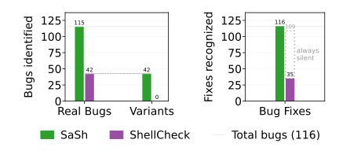
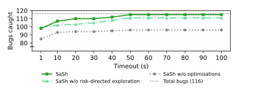
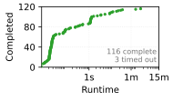

# SaSh: Ahead-of-time Analysis of Shell Program Effects

[Artifact Available](#artifact-available-10-minutes) | [Artifact Functional](#artifact-functional-20-minutes) | [Results Reproduced](#results-reproduced-6-hours) | [Bug Reports](#optional-bugs-found-in-the-wild) | [Contact](#contact)

The paper makes the following contributions:

1. **Optimistic symbolic execution engine (§3)**: A system, SaSh, that simulates shell program execution over symbolic variables, incorporating domain-specific failure modes to prune the state space.
2. **Effect and environment modeling (§4)**: A non-hierarchical filesystem model and compositional command specifications for reasoning about program-environment interactions.
3. **Abstract expansion domain (§5)**: An abstract domain capturing coarse constraints on shell expansion outcomes, enabling tractable reasoning about field splitting and related bugs.
4. **Risk-directed path prioritization (§6)**: Domain-specific optimizations that steer analysis toward program fragments likely to exhibit dangerous behavior.

SaSh is evaluated on 61 real-world shell programs containing 116 documented bugs (§7.1), compared against ShellCheck (§7.2), and characterized for performance across time budgets and 119 programs from [the Koala benchmark suite](https://kben.sh/) (§7.3). It has also uncovered 70 previously unknown bugs in open-source projects including PyTorch, Kubernetes, Next.js, and vLLM.

This artifact targets the following badges:

* [Artifact Available](#artifact-available): Reviewers confirm the artifact is publicly archived with an appropriate license (~10 min).
* [Artifact Functional](#artifact-functional): Reviewers install SaSh, verify key components, and run a minimal example (~20 min).
* [Results Reproduced](#results-reproduced): Reviewers reproduce the paper's main evaluation figures and tables (~6 h).


# Artifact Available (10 minutes)

Reviewers should confirm the following:

* **Repository**: The artifact is available at [https://github.com/atlas-brown/sash](https://github.com/atlas-brown/sash) (branch `sosp26-ae` will be frozen) and archived at [Zenodo](https://zenodo.org/) (DOI TBD).
* **License**: MIT license, allowing comparison and extension.
* **README**: The top-level [README](README.md) references the paper and provides installation instructions.


# Artifact Functional (20 minutes)


## Installation

SaSh can be installed natively or via Docker on Linux and MacOS. Instructions can be found in [README.md](README.md#installation).

**Evaluation-specific dependencies**: The evaluation script ([`scripts/eval.sh`](scripts/eval.sh)) additionally requires [`cloc`](https://github.com/AlDanial/cloc) (e.g., `apt install cloc`, `brew install cloc`).

> [!TIP]
> If you plan to evaluate SaSh through Docker, there's no need to install `cloc` locally.


## Completeness

The artifact contains all code and data relevant to the paper:

| Component | Location | Paper Reference |
|-----------|----------|-----------------|
| Symbolic execution engine (including symbolic word expansion), command specifications, filesystem model | [`src/sash/symb.py`](src/sash/symb.py), [`src/sash/specs.py`](src/sash/specs.py), [`src/sash/fs.py`](src/sash/fs.py), respectively | §3–§6 |
| 61 real buggy programs (116 bugs) and 42 synthetic variants | [`benchmarks/bugs_and_variants/`](benchmarks/bugs_and_variants/) | §7.1, §7.2 |
| 119 Koala benchmark programs | [`benchmarks/koala/`](benchmarks/koala/) | §7.3 |
| Evaluation scripts | [`scripts/eval.sh`](scripts/eval.sh) and other scripts in the same directory | §7 |
| Bug reports filed in open-source projects | [`benchmarks/bug_reports.md`](benchmarks/bug_reports.md) | §7.4 |


## Minimal Working Example

To verify basic functionality, run SaSh on the Steam updater bug from §2:

```bash
sash -t 5 benchmarks/bugs_and_variants/hp-steam/posix.sh
```

The expected output should include a warning about the deletion of `/*` due to an empty `$STEAMROOT` variable, similar to:

```
> Line 359 (error): Word splitting or empty variable could lead to deletion of system file /*
```

This corresponds to the bug described in Figure 1 of the paper, where a failed `cd` causes `STEAMROOT` to be empty, leading `rm -rf "$STEAMROOT/"*` to expand to `rm -rf /*`.


# Results Reproduced (6 hours)

> [!IMPORTANT]
> If you want to run the evaluation through Docker, run the following command before reading the rest of the section:
> ```bash
> docker build --target dev -t sash-dev .
> ```

> [!TIP]
> To reproduce **all** results and figures in a single command:
> ```bash
> # Native
> ./scripts/eval.sh
> # Docker
> docker run --rm -v "$(pwd)":/app sash-dev ./scripts/eval.sh
> ```

> [!TIP]
> Precomputed results and figures can be found in [`results/precomputed`](results/precomputed/), along with the exact commands used to produce them in [`results/precomputed/_metadata`](results/precomputed/_metadata/).


## Key Results: Bug Detection Effectiveness (§7.1, §7.2) (1 hour)

This experiment runs SaSh on all 61 buggy programs, their fixed versions, and all buggy variants mentioned in the paper. It then compares the output to the programs' ground truths. The programs, along with the ground truths, can be found in [`benchmarks/bugs_and_variants`](benchmarks/bugs_and_variants/).

To run the experiment:
```bash
# Native
./scripts/eval.sh --main
# Docker
docker run --rm -v "$(pwd)":/app sash-dev ./scripts/eval.sh --main
```

**Outputs**:
- `results/figures/main-eval.svg` (corresponds to Fig. 8)
- `results/main-eval/results_t60.csv` (CSV with all results, used to create the aforementioned figure)
- `results/table.tex` (the table in appendix A)

Precomputed figure, found in [`results/precomputed/figures/main-eval.svg`](results/precomputed/figures/main-eval.svg):




## Performance Analysis — Timeout Sweep (§7.3) (3.5 hours)

This experiment runs SaSh on all 61 buggy programs and their fixed versions with different timeouts (1s-100s) and three configurations: base symbolic execution, optimistic execution without risk-directed exploration, and full SaSh. The goal is to see the effect of the timeout choice and the optimizations on the bug-finding effectiveness of the system.

To run the experiment:
```bash
# Native
./scripts/eval.sh --sweep
# Docker
docker run --rm -v "$(pwd)":/app sash-dev ./scripts/eval.sh --sweep
```

**Outputs**:
- `results/figures/timeout-sweep.svg` (corresponds to Fig. 9)
- `results/timeout-sweep/results_t*_*.csv` (CSV with all results, used to create the aforementioned figure)

Precomputed figure, found in [`results/precomputed/figures/timeout-sweep.svg`](results/precomputed/figures/timeout-sweep.svg):




## Performance Analysis — Koala (§7.3) (1.5 hours)

This experiment runs SaSh on all 119 programs from the Koala benchmark suite to measure the time required for complete analysis (full exploration of each program), with a cap at 15 minutes.

```bash
# Native
./scripts/eval.sh --koala
# Docker
docker run --rm -v "$(pwd)":/app sash-dev ./scripts/eval.sh --koala
```

**Outputs**:
- `results/figures/koala.svg` (corresponds to the inline CDF in §7.3)
- `results/koala-eval/results_t900.csv` (CSV with all results, used to create the aforementioned figure)

Precomputed figure, found in [`results/precomputed/figures/koala.svg`](results/precomputed/figures/koala.svg):




## Appendix A Table

The appendix table is generated when running the [bug detection effectiveness evaluation](#71-bug-detection-effectiveness-1-hour).

**Output**:
- `results/table.tex`

This LaTeX table contains per-benchmark results including bug counts, false positives, runtime, and features used for detection. It corresponds to the full evaluation table in the appendix.


# Optional: Bugs Found in the Wild

The file [`benchmarks/bug_reports.md`](benchmarks/bug_reports.md) contains links to all 70 bugs SaSh identified in open-source projects, including PyTorch, Kubernetes, Next.js, vLLM, the P4 Compiler, and others. Reviewers may inspect the linked issues and pull requests to verify that the bugs were reported and, in many cases, confirmed and fixed by maintainers.


# Contact

For questions please contact <email>, or open an issue on GitHub.
