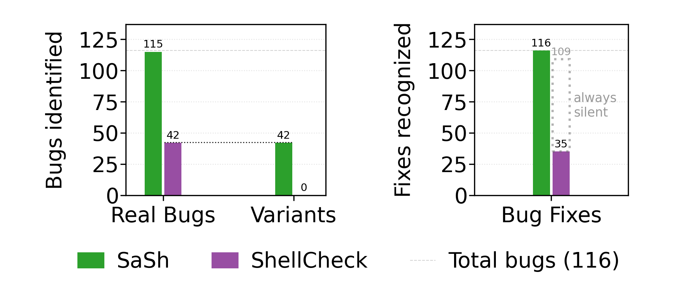
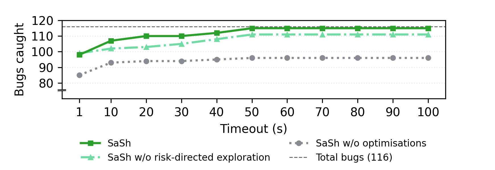
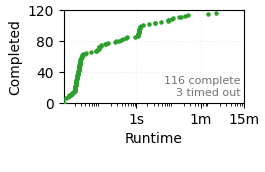

# SaSh: Ahead-of-time Analysis of Shell Program Effects

Quick jump: [Artifact Available](#artifact-available-10-minutes) | [Artifact Functional](#artifact-functional-20-minutes) | [Results Reproduced](#results-reproduced-6-hours) | [Bugs in the Wild](#optional-bugs-found-in-the-wild)

This is the artifact for paper #133 "Ahead-of-time Analysis of Shell Program Effects" accepted at SOSP'26.

The paper makes the following claims on pg. 2 (comments to AEC reviews after `:`):

1. **An optimistic symbolic execution engine (§3)**: a system that analyzes shell programs using symbolic execution and reports bugs corresponding to classes of misbehavior.
2. **Effect and environment modeling (§4)**: two subsystems: (1) a non-hierarchical model of the file system and (2) specifications that describe the effects of common shell commands over this model.
3. **Abstract expansion domain (§5)**: a subsystem implementing an abstract domain for shell expansion, tailor-made for uncovering field-splitting-related bugs.
4. **Risk-directed path prioritization (§6)**: a subsystem implementing several domain-specific optimizations that steer analysis toward program fragments likely to exhibit dangerous behavior.

This artifact targets the following badges:

- [ ] [Artifact Available](#artifact-available): Reviewers confirm the artifact is publicly archived with an appropriate license (~10 min).
- [ ] [Artifact Functional](#artifact-functional): Reviewers install SaSh, verify key components, and run a minimal example (~10 min).
- [ ] [Results Reproduced](#results-reproduced): Reviewers reproduce the paper's main evaluation figures and tables (~6 h).


# Artifact Available (10 minutes)

> Reviewers confirm the artifact is publicly archived with an appropriate license

Reviewers should confirm the following:

1. **Repository**: The artifact is available at [https://github.com/atlas-brown/sash](https://github.com/atlas-brown/sash) (branch `sosp26-ae` will be frozen) and archived at [Zenodo](https://zenodo.org/records/21288698) (DOI: 10.5281/zenodo.21288698).
2. **License**: The artifact contains an MIT license ([LICENSE](./LICENSE)), allowing comparison and extension.
3. **Documentation**: The top-level [INSTRUCTIONS.md](INSTRUCTIONS.md) and [README.md](README.md) go over all artifact contents, its mapping to the paper's contributions, and instructions for its installation and exercise.


# Artifact Functional (10 minutes)

> Reviewers install SaSh, verify key components, and run a minimal example

> [!CAUTION]
> Shell programs (files with a `.sh` suffix) inside `benchmarks/bugs_and_variants` are buggy and should _not_ be executed. Many of them perform unsafe operations that can lead to permanent data loss.

SaSh can be installed natively or via Docker on Linux and MacOS.


### Docker Installation (recommended, ~1.4gb required)

Run the following:

```bash
git clone https://github.com/atlas-brown/sash.git
cd sash
git checkout sosp26-ae
docker build --target dev -t sash .
docker run --rm -it -v "$(pwd)":/app -v /app/.venv sash  # You are now inside the container!
uv tool install . && uv tool update-shell; source /root/.bashrc  # Install sash as an executable command inside the container
sash --help  # Verify sash is runnable
```

The rest of the instructions assume you are inside the `sash` container, and specifically the `/app` directory.


### Manual Installation (~0.4gb required)

First, follow [the instructions in the README](README.md#manual-installation).
This will install SaSh as an executable, but for the evaluation the benchmarks present in the repo are needed.
Run the following:

```bash
sash --help  # Verify sash is runnable
git clone https://github.com/atlas-brown/sash.git
cd sash
git checkout sosp26-ae
uv sync  # Install python dependencies (needed for running the evaluation)
```

The rest of the instructions assume you are inside the root of the repository, can run `sash` as a command, and have `uv` installed.


## Completeness

The artifact contains all code and data relevant to the paper:

| Component | Location | Paper Reference |
|-----------|----------|-----------------|
| Symbolic execution engine | [`src/sash/symb.py:1290–3202`](src/sash/symb.py#L1290) | §3 |
| Filesystem model, command specifications | [`src/sash/fs.py`](src/sash/fs.py), [`src/sash/specs.py`](src/sash/specs.py) | §4 |
| Symbolic word expansion | [`src/sash/symb.py:281–1289`](src/sash/symb.py#L281) | §5 |
| Risk-directed exploration | [`src/sash/dfs_targeted.py`](src/sash/dfs_targeted.py), [`src/sash/symb.py:2968–3163`](src/sash/symb.py#L2968) | §6 |
| Evaluation scripts | [`scripts/eval.sh`](scripts/eval.sh) and other scripts in the same directory | §7 |
| 61 real buggy programs (116 bugs) and 42 synthetic variants | [`benchmarks/bugs_and_variants/`](benchmarks/bugs_and_variants/) | §7.1, §7.2 |
| 119 Koala benchmark programs | [`benchmarks/koala/`](benchmarks/koala/) | §7.3 |
| Bug reports filed in open-source projects | [`benchmarks/bug_reports.md`](benchmarks/bug_reports.md) | §7.4 |


### Dependencies

All dependencies of SaSh are listed in the [Dockerfile](Dockerfile) and [pyproject.toml](pyproject.toml).


## Minimal Working Example

To verify basic functionality, run SaSh on one of its benchmarks:

```bash
sash benchmarks/bugs_and_variants/sf-access_del_resource/posix.sh
```

The expected output should include a warning about an attempt to move a path that has been deleted:

```
> Line 9 (error): Command 'mv' expects paths that are directories, but one or more of the following paths might not be: /storage/sort_tv, workingfolder/
```

The script loops twice, on the first iteration deleting a directory (`workingfolder/`), and on the second iteration attempting to move it.

Running the fixed version of the script, the warning should disappear:

```bash
sash benchmarks/bugs_and_variants/sf-access_del_resource/fixed.sh
```

SaSh will still report possible bugs corresponding to other program fragments.
The evaluation from now on focuses on the specific bug that was fixed in each script.

The ground truth, which includes the source of the script as well as information about ShellCheck's output on it can be found in: [`benchmarks/bugs_and_variants/sf-access_del_resource/info.yaml`](benchmarks/bugs_and_variants/sf-access_del_resource/info.yaml).


# Results Reproduced (key results 40 min; all results 8 hr 40 min)

> Reviewers reproduce the paper's main evaluation figures and tables

> [!TIP]
> Precomputed results and figures can be found in [`results/precomputed`](results/precomputed/), along with the exact commands used to produce them in [`results/precomputed/_metadata`](results/precomputed/_metadata/). These results were produced by running the full evaluation on a [CloudLab c6525-25g node](www.utah.cloudlab.us/portal/show-nodetype.php?type=c6525-25g), on Ubuntu 22.04.2 LTS.


## Key Results: Bug Detection Effectiveness (40 min) (§7.1, §7.2)

This experiment runs SaSh on all 61 buggy programs, their fixed versions, and all buggy variants mentioned in the paper. It then compares the output to the programs' ground truths. The programs, along with the ground truths, can be found in [`benchmarks/bugs_and_variants`](benchmarks/bugs_and_variants/).

To run the experiment:
```bash
./scripts/eval.sh --main
```

### Outputs
- `results/figures/main-eval.png` (corresponds to Fig. 10)
- `results/main-eval/results_t60.csv` (CSV with all results, used to create the aforementioned figure)

Precomputed figure, found in [`results/precomputed/figures/main-eval.png`](results/precomputed/figures/main-eval.png):

<p align="center">
  
</p>


## Additional Results: Performance Analysis — Timeout Sweep (25 min; optionally 2 hr) (§7.3)

This experiment runs SaSh on all 61 buggy programs and their fixed versions with different timeouts (1s-100s) and three configurations: base symbolic execution, optimistic execution without risk-directed exploration, and full SaSh. The goal is to see the effect of the timeout choice and the optimizations on the bug-finding effectiveness of the system.


### Quick Run (25 min)

To run a subset of the experiment, for quick results that still showcase the importance of SaSh's optimizations, use the following command:
```bash
./scripts/eval.sh --sweep --sweep-timeouts 1,30,60
```


### Full Run (2 hr)

To run the full experiment, recreating the exact results of the paper:
```bash
./scripts/eval.sh --sweep
```


### Outputs
- `results/figures/timeout-sweep.png` (corresponds to Fig. 11)
- `results/timeout-sweep/results_t*_*.csv` (CSVs with all results, used to create the aforementioned figure)

Precomputed figure of the full experiment, found in [`results/precomputed/figures/timeout-sweep.png`](results/precomputed/figures/timeout-sweep.png):

<p align="center">
  
</p>


## Additional Results: Performance Analysis — Koala (10 min; optionally 3 hr) (§7.3)

This experiment runs SaSh on all 119 programs from the Koala benchmark suite to measure the time required for complete analysis (full exploration of each program), with a cap at 15 minutes.


### Quick Run (10 min)

To run a smaller version of the experiment, for quick results that still showcase the performance of SaSh on a diverse collection of programs:
```bash
./scripts/eval.sh --koala --skip-koala-harness --koala-timeout 60
```


### Full Run (3 hr)

To run the full experiment, recreating the exact results of the paper:
```bash
./scripts/eval.sh --koala
```


### Outputs
- `results/figures/koala.png` (corresponds to the inline CDF in §7.3)
- `results/koala-eval/results_t*.csv` (CSV with all results, used to create the aforementioned figure)

Precomputed figure of the full experiment, found in [`results/precomputed/figures/koala.png`](results/precomputed/figures/koala.png):

<p align="center">
  
</p>


# Optional: Bugs Found in the Wild (3 hr) (§7.4)

The file [`benchmarks/bug_reports.md`](benchmarks/bug_reports.md) contains links to all 70 bugs SaSh identified in open-source projects, including PyTorch, Kubernetes, Next.js, vLLM, the P4 Compiler, and others. Reviewers may inspect the linked issues and pull requests to verify that the bugs were reported and, in many cases, confirmed and fixed by maintainers.
